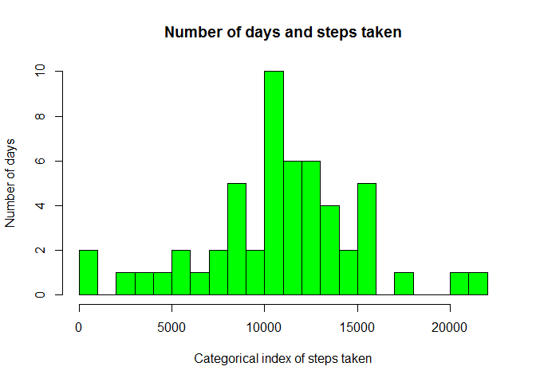
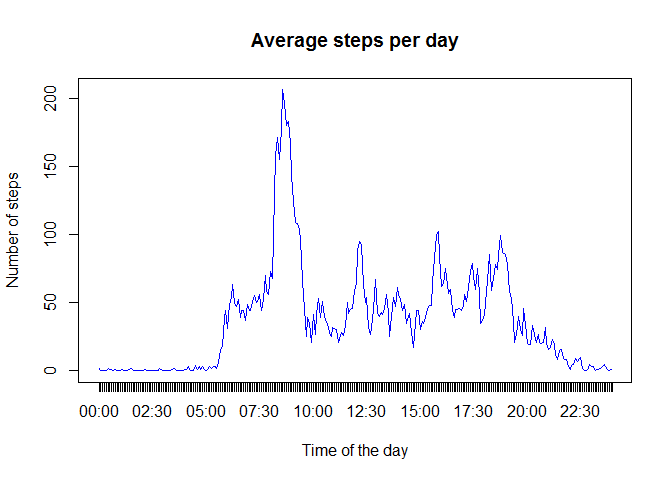
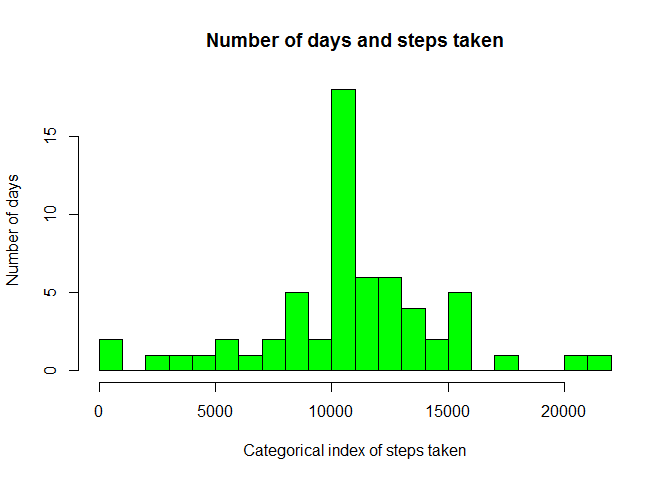
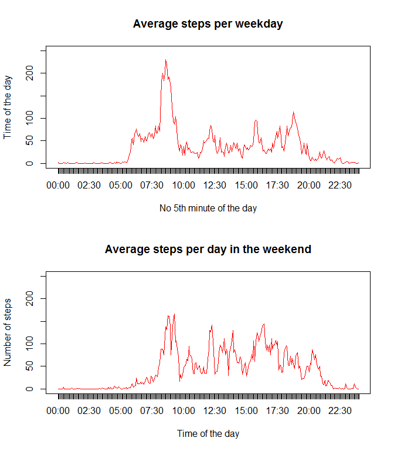

# Reproducible Research: Peer Assessment 1
Maikel Jonkers  


## Loading and preprocessing the data
Initiation of the code with clearing data/memory, setting working directory and loading libraries. 

```r
rm(list=ls())       # Clear data
gc()                # Clear memory R
```

```
##          used (Mb) gc trigger (Mb) max used (Mb)
## Ncells 370747 10.0     592000 15.9   460000 12.3
## Vcells 376261  2.9    1023718  7.9   752739  5.8
```

```r
# Set Working directory
oldwd <- getwd()
setwd("D:/NoBackup/Git/RepData_PeerAssessment1")
library(dplyr)
```

```
## Warning: package 'dplyr' was built under R version 3.3.3
```

```
## 
## Attaching package: 'dplyr'
```

```
## The following objects are masked from 'package:stats':
## 
##     filter, lag
```

```
## The following objects are masked from 'package:base':
## 
##     intersect, setdiff, setequal, union
```

```r
library(xtable)
```

```
## Warning: package 'xtable' was built under R version 3.3.3
```

#### 1. Load the data (i.e. read.csv())

```r
unzip(zipfile="activity.zip") 
df <- read.csv('activity.csv', sep=',')
```
#### 2. Process/transform the data (if necessary) into a format suitable for your analysis
The following steps are preformed:
- Make the data column a date class
- Make a new column 'time' with a string notation for the time corresponding with the interval
- Make a new column with the datetime as class POSIXct
- Make a counter for the interval of the day [1..288]

```r
df$date <- as.Date(df$date, "%Y-%m-%d")
df$time <- format(strptime(sprintf("%04d", df$interval), format="%H%M"), format = "%H:%M")
df$datetime <- as.POSIXct(paste(df$date, df$time), format="%Y-%m-%d %H:%M")
df$mincounter <- df$interval%%100/5 + floor(df$interval/100)*12+1
```


## What is mean total number of steps taken per day?
For this part of the assignment, the missing values in the dataset are ignored.

#### 1. Calculate the total number of steps taken per day
Below is the code shown to calculate the number of steps per day and save it in a new dataframe 'df_sum'

```r
df_sum <- aggregate(df$steps, by=list(Category=df$date), FUN=sum)
colnames(df_sum) <- c("Day", "SumNoSteps")
```

#### 2. Make a histogram of the total number of steps taken each day

```r
hist(df_sum$SumNoSteps, breaks = 25, main="Number of days and steps taken",xlab="Categorical index of steps taken", 
     ylab="Number of days", col='green')
```

<!-- -->

#### 3. Calculate and report the mean and median of the total number of steps taken per day
There a many days, so the tables are not small (61 rows, 2 columns)

```r
df_mean <- aggregate(df$steps, by=list(Category=df$date), FUN=mean)
colnames(df_mean) <- c("Day", "MeanNoSteps")
knitr::kable(df_mean, format = 'html')
```

<table>
 <thead>
  <tr>
   <th style="text-align:left;"> Day </th>
   <th style="text-align:right;"> MeanNoSteps </th>
  </tr>
 </thead>
<tbody>
  <tr>
   <td style="text-align:left;"> 2012-10-01 </td>
   <td style="text-align:right;"> NA </td>
  </tr>
  <tr>
   <td style="text-align:left;"> 2012-10-02 </td>
   <td style="text-align:right;"> 0.4375000 </td>
  </tr>
  <tr>
   <td style="text-align:left;"> 2012-10-03 </td>
   <td style="text-align:right;"> 39.4166667 </td>
  </tr>
  <tr>
   <td style="text-align:left;"> 2012-10-04 </td>
   <td style="text-align:right;"> 42.0694444 </td>
  </tr>
  <tr>
   <td style="text-align:left;"> 2012-10-05 </td>
   <td style="text-align:right;"> 46.1597222 </td>
  </tr>
  <tr>
   <td style="text-align:left;"> 2012-10-06 </td>
   <td style="text-align:right;"> 53.5416667 </td>
  </tr>
  <tr>
   <td style="text-align:left;"> 2012-10-07 </td>
   <td style="text-align:right;"> 38.2465278 </td>
  </tr>
  <tr>
   <td style="text-align:left;"> 2012-10-08 </td>
   <td style="text-align:right;"> NA </td>
  </tr>
  <tr>
   <td style="text-align:left;"> 2012-10-09 </td>
   <td style="text-align:right;"> 44.4826389 </td>
  </tr>
  <tr>
   <td style="text-align:left;"> 2012-10-10 </td>
   <td style="text-align:right;"> 34.3750000 </td>
  </tr>
  <tr>
   <td style="text-align:left;"> 2012-10-11 </td>
   <td style="text-align:right;"> 35.7777778 </td>
  </tr>
  <tr>
   <td style="text-align:left;"> 2012-10-12 </td>
   <td style="text-align:right;"> 60.3541667 </td>
  </tr>
  <tr>
   <td style="text-align:left;"> 2012-10-13 </td>
   <td style="text-align:right;"> 43.1458333 </td>
  </tr>
  <tr>
   <td style="text-align:left;"> 2012-10-14 </td>
   <td style="text-align:right;"> 52.4236111 </td>
  </tr>
  <tr>
   <td style="text-align:left;"> 2012-10-15 </td>
   <td style="text-align:right;"> 35.2048611 </td>
  </tr>
  <tr>
   <td style="text-align:left;"> 2012-10-16 </td>
   <td style="text-align:right;"> 52.3750000 </td>
  </tr>
  <tr>
   <td style="text-align:left;"> 2012-10-17 </td>
   <td style="text-align:right;"> 46.7083333 </td>
  </tr>
  <tr>
   <td style="text-align:left;"> 2012-10-18 </td>
   <td style="text-align:right;"> 34.9166667 </td>
  </tr>
  <tr>
   <td style="text-align:left;"> 2012-10-19 </td>
   <td style="text-align:right;"> 41.0729167 </td>
  </tr>
  <tr>
   <td style="text-align:left;"> 2012-10-20 </td>
   <td style="text-align:right;"> 36.0937500 </td>
  </tr>
  <tr>
   <td style="text-align:left;"> 2012-10-21 </td>
   <td style="text-align:right;"> 30.6284722 </td>
  </tr>
  <tr>
   <td style="text-align:left;"> 2012-10-22 </td>
   <td style="text-align:right;"> 46.7361111 </td>
  </tr>
  <tr>
   <td style="text-align:left;"> 2012-10-23 </td>
   <td style="text-align:right;"> 30.9652778 </td>
  </tr>
  <tr>
   <td style="text-align:left;"> 2012-10-24 </td>
   <td style="text-align:right;"> 29.0104167 </td>
  </tr>
  <tr>
   <td style="text-align:left;"> 2012-10-25 </td>
   <td style="text-align:right;"> 8.6527778 </td>
  </tr>
  <tr>
   <td style="text-align:left;"> 2012-10-26 </td>
   <td style="text-align:right;"> 23.5347222 </td>
  </tr>
  <tr>
   <td style="text-align:left;"> 2012-10-27 </td>
   <td style="text-align:right;"> 35.1354167 </td>
  </tr>
  <tr>
   <td style="text-align:left;"> 2012-10-28 </td>
   <td style="text-align:right;"> 39.7847222 </td>
  </tr>
  <tr>
   <td style="text-align:left;"> 2012-10-29 </td>
   <td style="text-align:right;"> 17.4236111 </td>
  </tr>
  <tr>
   <td style="text-align:left;"> 2012-10-30 </td>
   <td style="text-align:right;"> 34.0937500 </td>
  </tr>
  <tr>
   <td style="text-align:left;"> 2012-10-31 </td>
   <td style="text-align:right;"> 53.5208333 </td>
  </tr>
  <tr>
   <td style="text-align:left;"> 2012-11-01 </td>
   <td style="text-align:right;"> NA </td>
  </tr>
  <tr>
   <td style="text-align:left;"> 2012-11-02 </td>
   <td style="text-align:right;"> 36.8055556 </td>
  </tr>
  <tr>
   <td style="text-align:left;"> 2012-11-03 </td>
   <td style="text-align:right;"> 36.7048611 </td>
  </tr>
  <tr>
   <td style="text-align:left;"> 2012-11-04 </td>
   <td style="text-align:right;"> NA </td>
  </tr>
  <tr>
   <td style="text-align:left;"> 2012-11-05 </td>
   <td style="text-align:right;"> 36.2465278 </td>
  </tr>
  <tr>
   <td style="text-align:left;"> 2012-11-06 </td>
   <td style="text-align:right;"> 28.9375000 </td>
  </tr>
  <tr>
   <td style="text-align:left;"> 2012-11-07 </td>
   <td style="text-align:right;"> 44.7326389 </td>
  </tr>
  <tr>
   <td style="text-align:left;"> 2012-11-08 </td>
   <td style="text-align:right;"> 11.1770833 </td>
  </tr>
  <tr>
   <td style="text-align:left;"> 2012-11-09 </td>
   <td style="text-align:right;"> NA </td>
  </tr>
  <tr>
   <td style="text-align:left;"> 2012-11-10 </td>
   <td style="text-align:right;"> NA </td>
  </tr>
  <tr>
   <td style="text-align:left;"> 2012-11-11 </td>
   <td style="text-align:right;"> 43.7777778 </td>
  </tr>
  <tr>
   <td style="text-align:left;"> 2012-11-12 </td>
   <td style="text-align:right;"> 37.3784722 </td>
  </tr>
  <tr>
   <td style="text-align:left;"> 2012-11-13 </td>
   <td style="text-align:right;"> 25.4722222 </td>
  </tr>
  <tr>
   <td style="text-align:left;"> 2012-11-14 </td>
   <td style="text-align:right;"> NA </td>
  </tr>
  <tr>
   <td style="text-align:left;"> 2012-11-15 </td>
   <td style="text-align:right;"> 0.1423611 </td>
  </tr>
  <tr>
   <td style="text-align:left;"> 2012-11-16 </td>
   <td style="text-align:right;"> 18.8923611 </td>
  </tr>
  <tr>
   <td style="text-align:left;"> 2012-11-17 </td>
   <td style="text-align:right;"> 49.7881944 </td>
  </tr>
  <tr>
   <td style="text-align:left;"> 2012-11-18 </td>
   <td style="text-align:right;"> 52.4652778 </td>
  </tr>
  <tr>
   <td style="text-align:left;"> 2012-11-19 </td>
   <td style="text-align:right;"> 30.6979167 </td>
  </tr>
  <tr>
   <td style="text-align:left;"> 2012-11-20 </td>
   <td style="text-align:right;"> 15.5277778 </td>
  </tr>
  <tr>
   <td style="text-align:left;"> 2012-11-21 </td>
   <td style="text-align:right;"> 44.3993056 </td>
  </tr>
  <tr>
   <td style="text-align:left;"> 2012-11-22 </td>
   <td style="text-align:right;"> 70.9270833 </td>
  </tr>
  <tr>
   <td style="text-align:left;"> 2012-11-23 </td>
   <td style="text-align:right;"> 73.5902778 </td>
  </tr>
  <tr>
   <td style="text-align:left;"> 2012-11-24 </td>
   <td style="text-align:right;"> 50.2708333 </td>
  </tr>
  <tr>
   <td style="text-align:left;"> 2012-11-25 </td>
   <td style="text-align:right;"> 41.0902778 </td>
  </tr>
  <tr>
   <td style="text-align:left;"> 2012-11-26 </td>
   <td style="text-align:right;"> 38.7569444 </td>
  </tr>
  <tr>
   <td style="text-align:left;"> 2012-11-27 </td>
   <td style="text-align:right;"> 47.3819444 </td>
  </tr>
  <tr>
   <td style="text-align:left;"> 2012-11-28 </td>
   <td style="text-align:right;"> 35.3576389 </td>
  </tr>
  <tr>
   <td style="text-align:left;"> 2012-11-29 </td>
   <td style="text-align:right;"> 24.4687500 </td>
  </tr>
  <tr>
   <td style="text-align:left;"> 2012-11-30 </td>
   <td style="text-align:right;"> NA </td>
  </tr>
</tbody>
</table>

```r
df_median <- aggregate(df$steps, by=list(Category=df$date), FUN=median)
colnames(df_median) <- c("Day", "MedianNoSteps")
knitr::kable(df_median, format = 'html')
```

<table>
 <thead>
  <tr>
   <th style="text-align:left;"> Day </th>
   <th style="text-align:right;"> MedianNoSteps </th>
  </tr>
 </thead>
<tbody>
  <tr>
   <td style="text-align:left;"> 2012-10-01 </td>
   <td style="text-align:right;"> NA </td>
  </tr>
  <tr>
   <td style="text-align:left;"> 2012-10-02 </td>
   <td style="text-align:right;"> 0 </td>
  </tr>
  <tr>
   <td style="text-align:left;"> 2012-10-03 </td>
   <td style="text-align:right;"> 0 </td>
  </tr>
  <tr>
   <td style="text-align:left;"> 2012-10-04 </td>
   <td style="text-align:right;"> 0 </td>
  </tr>
  <tr>
   <td style="text-align:left;"> 2012-10-05 </td>
   <td style="text-align:right;"> 0 </td>
  </tr>
  <tr>
   <td style="text-align:left;"> 2012-10-06 </td>
   <td style="text-align:right;"> 0 </td>
  </tr>
  <tr>
   <td style="text-align:left;"> 2012-10-07 </td>
   <td style="text-align:right;"> 0 </td>
  </tr>
  <tr>
   <td style="text-align:left;"> 2012-10-08 </td>
   <td style="text-align:right;"> NA </td>
  </tr>
  <tr>
   <td style="text-align:left;"> 2012-10-09 </td>
   <td style="text-align:right;"> 0 </td>
  </tr>
  <tr>
   <td style="text-align:left;"> 2012-10-10 </td>
   <td style="text-align:right;"> 0 </td>
  </tr>
  <tr>
   <td style="text-align:left;"> 2012-10-11 </td>
   <td style="text-align:right;"> 0 </td>
  </tr>
  <tr>
   <td style="text-align:left;"> 2012-10-12 </td>
   <td style="text-align:right;"> 0 </td>
  </tr>
  <tr>
   <td style="text-align:left;"> 2012-10-13 </td>
   <td style="text-align:right;"> 0 </td>
  </tr>
  <tr>
   <td style="text-align:left;"> 2012-10-14 </td>
   <td style="text-align:right;"> 0 </td>
  </tr>
  <tr>
   <td style="text-align:left;"> 2012-10-15 </td>
   <td style="text-align:right;"> 0 </td>
  </tr>
  <tr>
   <td style="text-align:left;"> 2012-10-16 </td>
   <td style="text-align:right;"> 0 </td>
  </tr>
  <tr>
   <td style="text-align:left;"> 2012-10-17 </td>
   <td style="text-align:right;"> 0 </td>
  </tr>
  <tr>
   <td style="text-align:left;"> 2012-10-18 </td>
   <td style="text-align:right;"> 0 </td>
  </tr>
  <tr>
   <td style="text-align:left;"> 2012-10-19 </td>
   <td style="text-align:right;"> 0 </td>
  </tr>
  <tr>
   <td style="text-align:left;"> 2012-10-20 </td>
   <td style="text-align:right;"> 0 </td>
  </tr>
  <tr>
   <td style="text-align:left;"> 2012-10-21 </td>
   <td style="text-align:right;"> 0 </td>
  </tr>
  <tr>
   <td style="text-align:left;"> 2012-10-22 </td>
   <td style="text-align:right;"> 0 </td>
  </tr>
  <tr>
   <td style="text-align:left;"> 2012-10-23 </td>
   <td style="text-align:right;"> 0 </td>
  </tr>
  <tr>
   <td style="text-align:left;"> 2012-10-24 </td>
   <td style="text-align:right;"> 0 </td>
  </tr>
  <tr>
   <td style="text-align:left;"> 2012-10-25 </td>
   <td style="text-align:right;"> 0 </td>
  </tr>
  <tr>
   <td style="text-align:left;"> 2012-10-26 </td>
   <td style="text-align:right;"> 0 </td>
  </tr>
  <tr>
   <td style="text-align:left;"> 2012-10-27 </td>
   <td style="text-align:right;"> 0 </td>
  </tr>
  <tr>
   <td style="text-align:left;"> 2012-10-28 </td>
   <td style="text-align:right;"> 0 </td>
  </tr>
  <tr>
   <td style="text-align:left;"> 2012-10-29 </td>
   <td style="text-align:right;"> 0 </td>
  </tr>
  <tr>
   <td style="text-align:left;"> 2012-10-30 </td>
   <td style="text-align:right;"> 0 </td>
  </tr>
  <tr>
   <td style="text-align:left;"> 2012-10-31 </td>
   <td style="text-align:right;"> 0 </td>
  </tr>
  <tr>
   <td style="text-align:left;"> 2012-11-01 </td>
   <td style="text-align:right;"> NA </td>
  </tr>
  <tr>
   <td style="text-align:left;"> 2012-11-02 </td>
   <td style="text-align:right;"> 0 </td>
  </tr>
  <tr>
   <td style="text-align:left;"> 2012-11-03 </td>
   <td style="text-align:right;"> 0 </td>
  </tr>
  <tr>
   <td style="text-align:left;"> 2012-11-04 </td>
   <td style="text-align:right;"> NA </td>
  </tr>
  <tr>
   <td style="text-align:left;"> 2012-11-05 </td>
   <td style="text-align:right;"> 0 </td>
  </tr>
  <tr>
   <td style="text-align:left;"> 2012-11-06 </td>
   <td style="text-align:right;"> 0 </td>
  </tr>
  <tr>
   <td style="text-align:left;"> 2012-11-07 </td>
   <td style="text-align:right;"> 0 </td>
  </tr>
  <tr>
   <td style="text-align:left;"> 2012-11-08 </td>
   <td style="text-align:right;"> 0 </td>
  </tr>
  <tr>
   <td style="text-align:left;"> 2012-11-09 </td>
   <td style="text-align:right;"> NA </td>
  </tr>
  <tr>
   <td style="text-align:left;"> 2012-11-10 </td>
   <td style="text-align:right;"> NA </td>
  </tr>
  <tr>
   <td style="text-align:left;"> 2012-11-11 </td>
   <td style="text-align:right;"> 0 </td>
  </tr>
  <tr>
   <td style="text-align:left;"> 2012-11-12 </td>
   <td style="text-align:right;"> 0 </td>
  </tr>
  <tr>
   <td style="text-align:left;"> 2012-11-13 </td>
   <td style="text-align:right;"> 0 </td>
  </tr>
  <tr>
   <td style="text-align:left;"> 2012-11-14 </td>
   <td style="text-align:right;"> NA </td>
  </tr>
  <tr>
   <td style="text-align:left;"> 2012-11-15 </td>
   <td style="text-align:right;"> 0 </td>
  </tr>
  <tr>
   <td style="text-align:left;"> 2012-11-16 </td>
   <td style="text-align:right;"> 0 </td>
  </tr>
  <tr>
   <td style="text-align:left;"> 2012-11-17 </td>
   <td style="text-align:right;"> 0 </td>
  </tr>
  <tr>
   <td style="text-align:left;"> 2012-11-18 </td>
   <td style="text-align:right;"> 0 </td>
  </tr>
  <tr>
   <td style="text-align:left;"> 2012-11-19 </td>
   <td style="text-align:right;"> 0 </td>
  </tr>
  <tr>
   <td style="text-align:left;"> 2012-11-20 </td>
   <td style="text-align:right;"> 0 </td>
  </tr>
  <tr>
   <td style="text-align:left;"> 2012-11-21 </td>
   <td style="text-align:right;"> 0 </td>
  </tr>
  <tr>
   <td style="text-align:left;"> 2012-11-22 </td>
   <td style="text-align:right;"> 0 </td>
  </tr>
  <tr>
   <td style="text-align:left;"> 2012-11-23 </td>
   <td style="text-align:right;"> 0 </td>
  </tr>
  <tr>
   <td style="text-align:left;"> 2012-11-24 </td>
   <td style="text-align:right;"> 0 </td>
  </tr>
  <tr>
   <td style="text-align:left;"> 2012-11-25 </td>
   <td style="text-align:right;"> 0 </td>
  </tr>
  <tr>
   <td style="text-align:left;"> 2012-11-26 </td>
   <td style="text-align:right;"> 0 </td>
  </tr>
  <tr>
   <td style="text-align:left;"> 2012-11-27 </td>
   <td style="text-align:right;"> 0 </td>
  </tr>
  <tr>
   <td style="text-align:left;"> 2012-11-28 </td>
   <td style="text-align:right;"> 0 </td>
  </tr>
  <tr>
   <td style="text-align:left;"> 2012-11-29 </td>
   <td style="text-align:right;"> 0 </td>
  </tr>
  <tr>
   <td style="text-align:left;"> 2012-11-30 </td>
   <td style="text-align:right;"> NA </td>
  </tr>
</tbody>
</table>


## What is the average daily activity pattern?
#### 1. Make a time series plot (i.e. type = "l") of the 5-minute interval (x-axis) and the average number of steps taken, averaged across all days (y-axis)

```r
df_interval <-df[complete.cases(df),]
df_interval <- aggregate(df_interval$steps, by=list(Category=df_interval$mincounter), FUN=mean)
colnames(df_interval) <- c("time", "MeanNoSteps")
df_interval$MeanNoSteps <- round(df_interval$MeanNoSteps)
plot(df_interval$MeanNoSteps~df_interval$time, main = "Average steps per day", xlab = "Time of the day", ylab = "Number of steps", 
     xaxt="n", type = "l", col='blue')
axis(1, at=1:289, labels=df$time[1:289])
```

<!-- -->

#### 2. Which 5-minute interval, on average across all the days in the dataset, contains the maximum number of steps?

```r
MaxMincounter <- subset(df_interval$time, df_interval$MeanNoSteps == max(df_interval$MeanNoSteps))
MaxTime <- df[!duplicated(df$mincounter==MaxMincounter),4][[2]]
```
The number of interval where average maximum is made: 104

Time where averge maximum steps are made: 08:35


## Imputing missing values
Note that there are a number of days/intervals where there are missing values (coded as NA). The presence of missing days may introduce 
bias into some calculations or summaries of the data.

#### 1. Calculate and report the total number of missing values in the dataset (i.e. the total number of rows with NAs)

```r
NoRowsNa <- sum(is.na(df$steps))
```
The total number of missing values in the column "Steps": 2304


#### 2. Devise a strategy for filling in all of the missing values in the dataset. The strategy does not need to be sophisticated. For example, you could use the mean/median for that day, or the mean for that 5-minute interval, etc.
Strategy: Subsitute NaNs of the 'steps' column by the mean of that 5-minute interval.

#### 3. Create a new dataset that is equal to the original dataset but with the missing data filled in.
Code that makes new dataframe where NaNs for the column 'steps' are filled in. 

```r
df_ImputeNa <- df %>% 
    group_by(mincounter) %>% 
    mutate(steps= ifelse(is.na(steps), round(mean(steps, na.rm=TRUE)), steps))
```

```
## Warning: package 'bindrcpp' was built under R version 3.3.3
```

#### 4. Make a histogram of the total number of steps taken each day and Calculate and report the mean and median total number of steps taken per day. Do these values differ from the estimates from the first part of the assignment? What is the impact of imputing missing data on the estimates of the total daily number of steps?
Code for the histogram

```r
df_sumImpute <- aggregate(df_ImputeNa$steps, by=list(Category=df_ImputeNa$date), FUN=sum)
colnames(df_sumImpute) <- c("Day", "SumNoSteps")
hist(df_sumImpute$SumNoSteps, breaks = 25, main="Number of days and steps taken",xlab="Categorical index of steps taken", 
     ylab="Number of days", col='green')
```

<!-- -->

Code for the tables with the mean and median

```r
df_meanImpute <- aggregate(df_ImputeNa$steps, by=list(Category=df_ImputeNa$date), FUN=mean)
colnames(df_meanImpute) <- c("Day", "MeanNoSteps")
knitr::kable(df_meanImpute, format = 'html')
```

<table>
 <thead>
  <tr>
   <th style="text-align:left;"> Day </th>
   <th style="text-align:right;"> MeanNoSteps </th>
  </tr>
 </thead>
<tbody>
  <tr>
   <td style="text-align:left;"> 2012-10-01 </td>
   <td style="text-align:right;"> 37.3680556 </td>
  </tr>
  <tr>
   <td style="text-align:left;"> 2012-10-02 </td>
   <td style="text-align:right;"> 0.4375000 </td>
  </tr>
  <tr>
   <td style="text-align:left;"> 2012-10-03 </td>
   <td style="text-align:right;"> 39.4166667 </td>
  </tr>
  <tr>
   <td style="text-align:left;"> 2012-10-04 </td>
   <td style="text-align:right;"> 42.0694444 </td>
  </tr>
  <tr>
   <td style="text-align:left;"> 2012-10-05 </td>
   <td style="text-align:right;"> 46.1597222 </td>
  </tr>
  <tr>
   <td style="text-align:left;"> 2012-10-06 </td>
   <td style="text-align:right;"> 53.5416667 </td>
  </tr>
  <tr>
   <td style="text-align:left;"> 2012-10-07 </td>
   <td style="text-align:right;"> 38.2465278 </td>
  </tr>
  <tr>
   <td style="text-align:left;"> 2012-10-08 </td>
   <td style="text-align:right;"> 37.3680556 </td>
  </tr>
  <tr>
   <td style="text-align:left;"> 2012-10-09 </td>
   <td style="text-align:right;"> 44.4826389 </td>
  </tr>
  <tr>
   <td style="text-align:left;"> 2012-10-10 </td>
   <td style="text-align:right;"> 34.3750000 </td>
  </tr>
  <tr>
   <td style="text-align:left;"> 2012-10-11 </td>
   <td style="text-align:right;"> 35.7777778 </td>
  </tr>
  <tr>
   <td style="text-align:left;"> 2012-10-12 </td>
   <td style="text-align:right;"> 60.3541667 </td>
  </tr>
  <tr>
   <td style="text-align:left;"> 2012-10-13 </td>
   <td style="text-align:right;"> 43.1458333 </td>
  </tr>
  <tr>
   <td style="text-align:left;"> 2012-10-14 </td>
   <td style="text-align:right;"> 52.4236111 </td>
  </tr>
  <tr>
   <td style="text-align:left;"> 2012-10-15 </td>
   <td style="text-align:right;"> 35.2048611 </td>
  </tr>
  <tr>
   <td style="text-align:left;"> 2012-10-16 </td>
   <td style="text-align:right;"> 52.3750000 </td>
  </tr>
  <tr>
   <td style="text-align:left;"> 2012-10-17 </td>
   <td style="text-align:right;"> 46.7083333 </td>
  </tr>
  <tr>
   <td style="text-align:left;"> 2012-10-18 </td>
   <td style="text-align:right;"> 34.9166667 </td>
  </tr>
  <tr>
   <td style="text-align:left;"> 2012-10-19 </td>
   <td style="text-align:right;"> 41.0729167 </td>
  </tr>
  <tr>
   <td style="text-align:left;"> 2012-10-20 </td>
   <td style="text-align:right;"> 36.0937500 </td>
  </tr>
  <tr>
   <td style="text-align:left;"> 2012-10-21 </td>
   <td style="text-align:right;"> 30.6284722 </td>
  </tr>
  <tr>
   <td style="text-align:left;"> 2012-10-22 </td>
   <td style="text-align:right;"> 46.7361111 </td>
  </tr>
  <tr>
   <td style="text-align:left;"> 2012-10-23 </td>
   <td style="text-align:right;"> 30.9652778 </td>
  </tr>
  <tr>
   <td style="text-align:left;"> 2012-10-24 </td>
   <td style="text-align:right;"> 29.0104167 </td>
  </tr>
  <tr>
   <td style="text-align:left;"> 2012-10-25 </td>
   <td style="text-align:right;"> 8.6527778 </td>
  </tr>
  <tr>
   <td style="text-align:left;"> 2012-10-26 </td>
   <td style="text-align:right;"> 23.5347222 </td>
  </tr>
  <tr>
   <td style="text-align:left;"> 2012-10-27 </td>
   <td style="text-align:right;"> 35.1354167 </td>
  </tr>
  <tr>
   <td style="text-align:left;"> 2012-10-28 </td>
   <td style="text-align:right;"> 39.7847222 </td>
  </tr>
  <tr>
   <td style="text-align:left;"> 2012-10-29 </td>
   <td style="text-align:right;"> 17.4236111 </td>
  </tr>
  <tr>
   <td style="text-align:left;"> 2012-10-30 </td>
   <td style="text-align:right;"> 34.0937500 </td>
  </tr>
  <tr>
   <td style="text-align:left;"> 2012-10-31 </td>
   <td style="text-align:right;"> 53.5208333 </td>
  </tr>
  <tr>
   <td style="text-align:left;"> 2012-11-01 </td>
   <td style="text-align:right;"> 37.3680556 </td>
  </tr>
  <tr>
   <td style="text-align:left;"> 2012-11-02 </td>
   <td style="text-align:right;"> 36.8055556 </td>
  </tr>
  <tr>
   <td style="text-align:left;"> 2012-11-03 </td>
   <td style="text-align:right;"> 36.7048611 </td>
  </tr>
  <tr>
   <td style="text-align:left;"> 2012-11-04 </td>
   <td style="text-align:right;"> 37.3680556 </td>
  </tr>
  <tr>
   <td style="text-align:left;"> 2012-11-05 </td>
   <td style="text-align:right;"> 36.2465278 </td>
  </tr>
  <tr>
   <td style="text-align:left;"> 2012-11-06 </td>
   <td style="text-align:right;"> 28.9375000 </td>
  </tr>
  <tr>
   <td style="text-align:left;"> 2012-11-07 </td>
   <td style="text-align:right;"> 44.7326389 </td>
  </tr>
  <tr>
   <td style="text-align:left;"> 2012-11-08 </td>
   <td style="text-align:right;"> 11.1770833 </td>
  </tr>
  <tr>
   <td style="text-align:left;"> 2012-11-09 </td>
   <td style="text-align:right;"> 37.3680556 </td>
  </tr>
  <tr>
   <td style="text-align:left;"> 2012-11-10 </td>
   <td style="text-align:right;"> 37.3680556 </td>
  </tr>
  <tr>
   <td style="text-align:left;"> 2012-11-11 </td>
   <td style="text-align:right;"> 43.7777778 </td>
  </tr>
  <tr>
   <td style="text-align:left;"> 2012-11-12 </td>
   <td style="text-align:right;"> 37.3784722 </td>
  </tr>
  <tr>
   <td style="text-align:left;"> 2012-11-13 </td>
   <td style="text-align:right;"> 25.4722222 </td>
  </tr>
  <tr>
   <td style="text-align:left;"> 2012-11-14 </td>
   <td style="text-align:right;"> 37.3680556 </td>
  </tr>
  <tr>
   <td style="text-align:left;"> 2012-11-15 </td>
   <td style="text-align:right;"> 0.1423611 </td>
  </tr>
  <tr>
   <td style="text-align:left;"> 2012-11-16 </td>
   <td style="text-align:right;"> 18.8923611 </td>
  </tr>
  <tr>
   <td style="text-align:left;"> 2012-11-17 </td>
   <td style="text-align:right;"> 49.7881944 </td>
  </tr>
  <tr>
   <td style="text-align:left;"> 2012-11-18 </td>
   <td style="text-align:right;"> 52.4652778 </td>
  </tr>
  <tr>
   <td style="text-align:left;"> 2012-11-19 </td>
   <td style="text-align:right;"> 30.6979167 </td>
  </tr>
  <tr>
   <td style="text-align:left;"> 2012-11-20 </td>
   <td style="text-align:right;"> 15.5277778 </td>
  </tr>
  <tr>
   <td style="text-align:left;"> 2012-11-21 </td>
   <td style="text-align:right;"> 44.3993056 </td>
  </tr>
  <tr>
   <td style="text-align:left;"> 2012-11-22 </td>
   <td style="text-align:right;"> 70.9270833 </td>
  </tr>
  <tr>
   <td style="text-align:left;"> 2012-11-23 </td>
   <td style="text-align:right;"> 73.5902778 </td>
  </tr>
  <tr>
   <td style="text-align:left;"> 2012-11-24 </td>
   <td style="text-align:right;"> 50.2708333 </td>
  </tr>
  <tr>
   <td style="text-align:left;"> 2012-11-25 </td>
   <td style="text-align:right;"> 41.0902778 </td>
  </tr>
  <tr>
   <td style="text-align:left;"> 2012-11-26 </td>
   <td style="text-align:right;"> 38.7569444 </td>
  </tr>
  <tr>
   <td style="text-align:left;"> 2012-11-27 </td>
   <td style="text-align:right;"> 47.3819444 </td>
  </tr>
  <tr>
   <td style="text-align:left;"> 2012-11-28 </td>
   <td style="text-align:right;"> 35.3576389 </td>
  </tr>
  <tr>
   <td style="text-align:left;"> 2012-11-29 </td>
   <td style="text-align:right;"> 24.4687500 </td>
  </tr>
  <tr>
   <td style="text-align:left;"> 2012-11-30 </td>
   <td style="text-align:right;"> 37.3680556 </td>
  </tr>
</tbody>
</table>

```r
df_medianImpute <- aggregate(df_ImputeNa$steps, by=list(Category=df_ImputeNa$date), FUN=median)
colnames(df_medianImpute) <- c("Day", "MedianNoSteps")
knitr::kable(df_medianImpute, format = 'html')
```

<table>
 <thead>
  <tr>
   <th style="text-align:left;"> Day </th>
   <th style="text-align:right;"> MedianNoSteps </th>
  </tr>
 </thead>
<tbody>
  <tr>
   <td style="text-align:left;"> 2012-10-01 </td>
   <td style="text-align:right;"> 34.5 </td>
  </tr>
  <tr>
   <td style="text-align:left;"> 2012-10-02 </td>
   <td style="text-align:right;"> 0.0 </td>
  </tr>
  <tr>
   <td style="text-align:left;"> 2012-10-03 </td>
   <td style="text-align:right;"> 0.0 </td>
  </tr>
  <tr>
   <td style="text-align:left;"> 2012-10-04 </td>
   <td style="text-align:right;"> 0.0 </td>
  </tr>
  <tr>
   <td style="text-align:left;"> 2012-10-05 </td>
   <td style="text-align:right;"> 0.0 </td>
  </tr>
  <tr>
   <td style="text-align:left;"> 2012-10-06 </td>
   <td style="text-align:right;"> 0.0 </td>
  </tr>
  <tr>
   <td style="text-align:left;"> 2012-10-07 </td>
   <td style="text-align:right;"> 0.0 </td>
  </tr>
  <tr>
   <td style="text-align:left;"> 2012-10-08 </td>
   <td style="text-align:right;"> 34.5 </td>
  </tr>
  <tr>
   <td style="text-align:left;"> 2012-10-09 </td>
   <td style="text-align:right;"> 0.0 </td>
  </tr>
  <tr>
   <td style="text-align:left;"> 2012-10-10 </td>
   <td style="text-align:right;"> 0.0 </td>
  </tr>
  <tr>
   <td style="text-align:left;"> 2012-10-11 </td>
   <td style="text-align:right;"> 0.0 </td>
  </tr>
  <tr>
   <td style="text-align:left;"> 2012-10-12 </td>
   <td style="text-align:right;"> 0.0 </td>
  </tr>
  <tr>
   <td style="text-align:left;"> 2012-10-13 </td>
   <td style="text-align:right;"> 0.0 </td>
  </tr>
  <tr>
   <td style="text-align:left;"> 2012-10-14 </td>
   <td style="text-align:right;"> 0.0 </td>
  </tr>
  <tr>
   <td style="text-align:left;"> 2012-10-15 </td>
   <td style="text-align:right;"> 0.0 </td>
  </tr>
  <tr>
   <td style="text-align:left;"> 2012-10-16 </td>
   <td style="text-align:right;"> 0.0 </td>
  </tr>
  <tr>
   <td style="text-align:left;"> 2012-10-17 </td>
   <td style="text-align:right;"> 0.0 </td>
  </tr>
  <tr>
   <td style="text-align:left;"> 2012-10-18 </td>
   <td style="text-align:right;"> 0.0 </td>
  </tr>
  <tr>
   <td style="text-align:left;"> 2012-10-19 </td>
   <td style="text-align:right;"> 0.0 </td>
  </tr>
  <tr>
   <td style="text-align:left;"> 2012-10-20 </td>
   <td style="text-align:right;"> 0.0 </td>
  </tr>
  <tr>
   <td style="text-align:left;"> 2012-10-21 </td>
   <td style="text-align:right;"> 0.0 </td>
  </tr>
  <tr>
   <td style="text-align:left;"> 2012-10-22 </td>
   <td style="text-align:right;"> 0.0 </td>
  </tr>
  <tr>
   <td style="text-align:left;"> 2012-10-23 </td>
   <td style="text-align:right;"> 0.0 </td>
  </tr>
  <tr>
   <td style="text-align:left;"> 2012-10-24 </td>
   <td style="text-align:right;"> 0.0 </td>
  </tr>
  <tr>
   <td style="text-align:left;"> 2012-10-25 </td>
   <td style="text-align:right;"> 0.0 </td>
  </tr>
  <tr>
   <td style="text-align:left;"> 2012-10-26 </td>
   <td style="text-align:right;"> 0.0 </td>
  </tr>
  <tr>
   <td style="text-align:left;"> 2012-10-27 </td>
   <td style="text-align:right;"> 0.0 </td>
  </tr>
  <tr>
   <td style="text-align:left;"> 2012-10-28 </td>
   <td style="text-align:right;"> 0.0 </td>
  </tr>
  <tr>
   <td style="text-align:left;"> 2012-10-29 </td>
   <td style="text-align:right;"> 0.0 </td>
  </tr>
  <tr>
   <td style="text-align:left;"> 2012-10-30 </td>
   <td style="text-align:right;"> 0.0 </td>
  </tr>
  <tr>
   <td style="text-align:left;"> 2012-10-31 </td>
   <td style="text-align:right;"> 0.0 </td>
  </tr>
  <tr>
   <td style="text-align:left;"> 2012-11-01 </td>
   <td style="text-align:right;"> 34.5 </td>
  </tr>
  <tr>
   <td style="text-align:left;"> 2012-11-02 </td>
   <td style="text-align:right;"> 0.0 </td>
  </tr>
  <tr>
   <td style="text-align:left;"> 2012-11-03 </td>
   <td style="text-align:right;"> 0.0 </td>
  </tr>
  <tr>
   <td style="text-align:left;"> 2012-11-04 </td>
   <td style="text-align:right;"> 34.5 </td>
  </tr>
  <tr>
   <td style="text-align:left;"> 2012-11-05 </td>
   <td style="text-align:right;"> 0.0 </td>
  </tr>
  <tr>
   <td style="text-align:left;"> 2012-11-06 </td>
   <td style="text-align:right;"> 0.0 </td>
  </tr>
  <tr>
   <td style="text-align:left;"> 2012-11-07 </td>
   <td style="text-align:right;"> 0.0 </td>
  </tr>
  <tr>
   <td style="text-align:left;"> 2012-11-08 </td>
   <td style="text-align:right;"> 0.0 </td>
  </tr>
  <tr>
   <td style="text-align:left;"> 2012-11-09 </td>
   <td style="text-align:right;"> 34.5 </td>
  </tr>
  <tr>
   <td style="text-align:left;"> 2012-11-10 </td>
   <td style="text-align:right;"> 34.5 </td>
  </tr>
  <tr>
   <td style="text-align:left;"> 2012-11-11 </td>
   <td style="text-align:right;"> 0.0 </td>
  </tr>
  <tr>
   <td style="text-align:left;"> 2012-11-12 </td>
   <td style="text-align:right;"> 0.0 </td>
  </tr>
  <tr>
   <td style="text-align:left;"> 2012-11-13 </td>
   <td style="text-align:right;"> 0.0 </td>
  </tr>
  <tr>
   <td style="text-align:left;"> 2012-11-14 </td>
   <td style="text-align:right;"> 34.5 </td>
  </tr>
  <tr>
   <td style="text-align:left;"> 2012-11-15 </td>
   <td style="text-align:right;"> 0.0 </td>
  </tr>
  <tr>
   <td style="text-align:left;"> 2012-11-16 </td>
   <td style="text-align:right;"> 0.0 </td>
  </tr>
  <tr>
   <td style="text-align:left;"> 2012-11-17 </td>
   <td style="text-align:right;"> 0.0 </td>
  </tr>
  <tr>
   <td style="text-align:left;"> 2012-11-18 </td>
   <td style="text-align:right;"> 0.0 </td>
  </tr>
  <tr>
   <td style="text-align:left;"> 2012-11-19 </td>
   <td style="text-align:right;"> 0.0 </td>
  </tr>
  <tr>
   <td style="text-align:left;"> 2012-11-20 </td>
   <td style="text-align:right;"> 0.0 </td>
  </tr>
  <tr>
   <td style="text-align:left;"> 2012-11-21 </td>
   <td style="text-align:right;"> 0.0 </td>
  </tr>
  <tr>
   <td style="text-align:left;"> 2012-11-22 </td>
   <td style="text-align:right;"> 0.0 </td>
  </tr>
  <tr>
   <td style="text-align:left;"> 2012-11-23 </td>
   <td style="text-align:right;"> 0.0 </td>
  </tr>
  <tr>
   <td style="text-align:left;"> 2012-11-24 </td>
   <td style="text-align:right;"> 0.0 </td>
  </tr>
  <tr>
   <td style="text-align:left;"> 2012-11-25 </td>
   <td style="text-align:right;"> 0.0 </td>
  </tr>
  <tr>
   <td style="text-align:left;"> 2012-11-26 </td>
   <td style="text-align:right;"> 0.0 </td>
  </tr>
  <tr>
   <td style="text-align:left;"> 2012-11-27 </td>
   <td style="text-align:right;"> 0.0 </td>
  </tr>
  <tr>
   <td style="text-align:left;"> 2012-11-28 </td>
   <td style="text-align:right;"> 0.0 </td>
  </tr>
  <tr>
   <td style="text-align:left;"> 2012-11-29 </td>
   <td style="text-align:right;"> 0.0 </td>
  </tr>
  <tr>
   <td style="text-align:left;"> 2012-11-30 </td>
   <td style="text-align:right;"> 34.5 </td>
  </tr>
</tbody>
</table>

##### Impact of imputing missing data
The impact is that the average is added to several days and time intervals, therefore the total number of steps and median has changed for the days where there were no values. The histograms shows this too (more days to count, and especially visible is the the average shows a higher peak).


## Are there differences in activity patterns between weekdays and weekends?
Dataset were the NaNs are filled is used. 

#### 1. Create a new factor variable in the dataset with two levels - "weekday" and "weekend" indicating whether a given date is a weekday or weekend day.
Code to create a new column with the notation if a day is a weekday or day in the weekend. Since I live in the Netherlands and my laptop is configured like this, the function 'weekdays' will give Dutch names. Therefore the factor has Dutch names!

```r
weekdaysDutch <- c('maandag', 'dinsdag', 'woensdag', 'donderdag', 'vrijdag')
df_ImputeNa$weekday <- factor((weekdays(df_ImputeNa$date) %in% weekdaysDutch), 
                   levels=c(FALSE, TRUE), labels=c('weekend', 'weekday')) 
```

#### 2. Make a panel plot containing a time series plot (i.e. type = "l") of the 5-minute interval (x-axis) and the average number of steps taken, averaged across all weekday days or weekend days (y-axis). See the README file in the GitHub repository to see an example of what this plot should look like using simulated data.

Data preperation for weekday:

```r
df_intervalWeekday <- aggregate(df_ImputeNa$steps[df_ImputeNa$weekday=='weekday'], 
                                by=list(Category=df_ImputeNa$mincounter[df_ImputeNa$weekday=='weekday']), FUN=mean)
colnames(df_intervalWeekday) <- c("time", "MeanNoStepsWeekday")
df_intervalWeekday$MeanNoStepsWeekday <- round(df_intervalWeekday$MeanNoStepsWeekday)
```

Data preperation for weekend:

```r
df_intervalWeekend <- aggregate(df_ImputeNa$steps[df_ImputeNa$weekday=='weekend'], 
                                by=list(Category=df_ImputeNa$mincounter[df_ImputeNa$weekday=='weekend']), FUN=mean)
colnames(df_intervalWeekend) <- c("time", "MeanNoStepsWeekend")
df_intervalWeekend$MeanNoStepsWeekend <- round(df_intervalWeekend$MeanNoStepsWeekend)
```
Code to make plot (combine two plots as one):

```r
par(mfrow=c(2,1)) 
plot(df_intervalWeekday$MeanNoStepsWeekday~df_intervalWeekday$time, main = "Average steps per weekday", xlab = "No 5th minute of the day", 
     ylab = "Time of the day", ylim=c(0,250), xaxt="n", type = "l", col='red')
axis(1, at=1:289, labels=df_ImputeNa$time[1:289])
plot(df_intervalWeekend$MeanNoStepsWeekend~df_intervalWeekend$time, main = "Average steps per day in the weekend", 
     xlab = "Time of the day", ylim=c(0,250), ylab = "Number of steps", xaxt="n", type = "l", col='red')
axis(1, at=1:289, labels=df_ImputeNa$time[1:289])
```

<!-- -->


To old working directory

```r
setwd(oldwd)
```
